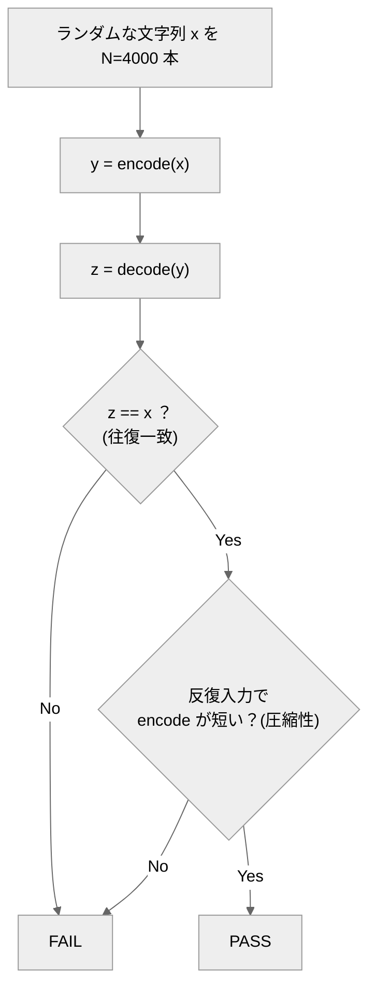

# roundtrip-rle-agent

*A run-length encoding (RLE) agent graded by a property-based round-trip oracle: `decode(encode(x)) == x` over thousands of random inputs, plus multi-point compressibility checks.*
*No hand-written expected outputs — and the oracle validates itself against known-broken implementations (negative controls).*

文字列を**ランレングス符号化**する `encode`／`decode` を実装するエージェントと、**「変換して戻すと元に戻る」性質で判定する**オラクル（採点プログラム）。

専門用語を使わない説明は [説明書.md](説明書.md) にあります。

## 概要

encode の出力（"aaabb"→"a3b2"）の正解をいちいち書き出すのは大変で、実装を変えると壊れます。
このリポジトリは、正しさを**入力に常に成り立つ性質**で確かめる **プロパティベース（往復）オラクル** の実例です。

中心の性質は1本：**どんな x でも `decode(encode(x)) == x`**。ランダムな x を大量に作って突くので、encode/decode の片方だけずれる非対称なバグが必ず露見します。「恒等変換でも往復は通る」抜け穴は、**反復入力は圧縮される**第2の性質でふさぎます。

## クイックスタート

必要なもの：Python 3 のみ。**リポジトリのルートで実行**。

```bash
python eval/oracle.py            # 正しいRLE(reference)を採点 → PASS
python eval/oracle.py --selftest # オラクル自身を検証（②でFAILが出るのが正常）
```

→ ①は採点表に `PASS`、②は最後に `## オラクル判定: PASS`。どちらも終了コード 0（②で壊れた実装に FAIL が出るのは正常）。

## エージェントの動かし方

`.claude/agents/roundtrip-rle-agent.md` の指示で `eval/corpus/candidate.py` に `encode(s)`／`decode(s)` を実装し、`python eval/oracle.py --candidate candidate` で採点。candidate が無くても `reference` で全工程を再現できます。

## しくみ



## 合否（eval）
固定種でランダム文字列を多数作り、(1) すべてで decode(encode(x))==x、(2) 反復入力（複数の文字 × 複数の長さ、計12点）は encode で短くなる。両方満たせば PASS。

## ファイル構成
- `.claude/agents/…md` … エージェント定義／`eval/oracle.py` … 往復オラクル（`--selftest` 内蔵）
- `eval/corpus/reference.py` … 正例（encode＋decode）／`broken_*.py` … 既知バグ（陰性対照）
- `design/design.md` … 設計の考え方

---
自作 AI エージェント集（評価駆動開発の実証）の一つ。背景は [design/design.md](design/design.md)。
